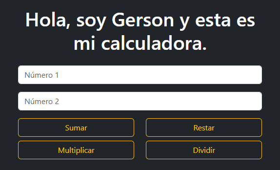
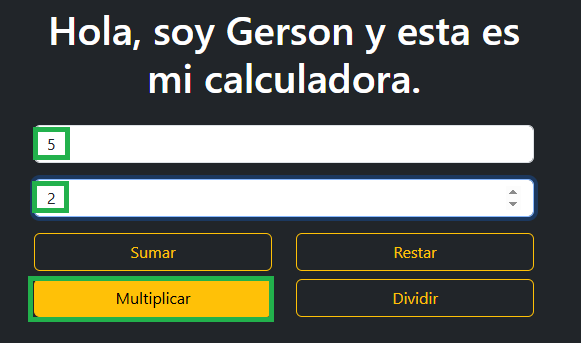

# Calculadora Web en Django

Calculadora web básica hecha con **Django** y **Bootstrap**, desarrollada como proyecto de práctica. Permite realizar operaciones matemáticas básicas:

- Suma  
- Resta  
- Multiplicación  
- División  

---

##  Tecnologías utilizadas

- Python / Django  
- HTML / CSS / Bootstrap

---

##  Cómo ejecutar localmente

1. Clona el repositorio:
   ```bash 
   git clone https://github.com/Jerson-Giraldo/calculadora.git
   cd calculadora
```
Instala las dependencias (mejor crear un entorno virtual):
```bash 
pip install -r requirements.txt
```
Ejecuta el servidor:
```bash 
python manage.py runserver
```
Abre tu navegador en http://127.0.0.1:8000/ y usa la calculadora.

---

## Ejemplo de uso

A continuación, un ejemplo paso a paso de cómo funciona la calculadora:

### 1. Vista inicial
La calculadora solicita dos números y muestra las operaciones disponibles.  


### 2. Ingreso de valores y selección de operación
Se ingresan los números **5** y **2**, y se selecciona la operación **multiplicar**.  


### 3. Resultado de la operación
La aplicación muestra el resultado de la operación: **10**.  

